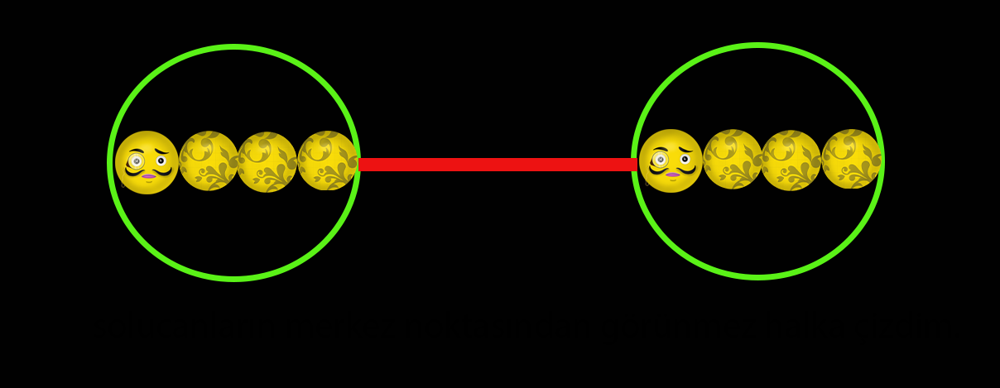
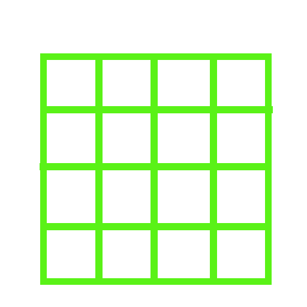

# Peki Worms Clone

 Bu proje Unity'nin hiçbir fizik tabanlı sistemi kullanılmadan geliştirilmiştir. 

Kurtların her objesine ayrı ayrı bakmak yerine kurdun merkezinden hayali bir circle collider oluşturdum.

Oyun alanını hayali karelere bölebildiğim bir method hazırladım. Yaptığım testler sonucunda en optimum değerin 16 olduğunu buldum. Oyun alanını 16 kareye böldüm. Kurtlar sadece kendilerinin bulunduğu karedeki diğer kurtlarla çarpışma testi yapıyor. Böylece bir kurt oyundaki kurtların düşük bir yüzdesiyle çarpışma testi yapıyor. Bu çarpışma testlerinde ilk olarak ilk resimde gösterdiğim hayali çemberlerle çarpışıp çarpışmadığına bakıyor. Eğer bir çarpışma mevcut ise geriye kalan durumları test ediyor. Bir çarpışma bulunmaz ise testi yapan kurt diğer kurda haber veriyor. Böylece diğer kurt gereksiz yere test yapmıyor. Yiyecekler ve güçlendirmeler içinde aynı sistemi kullanıyorum.

